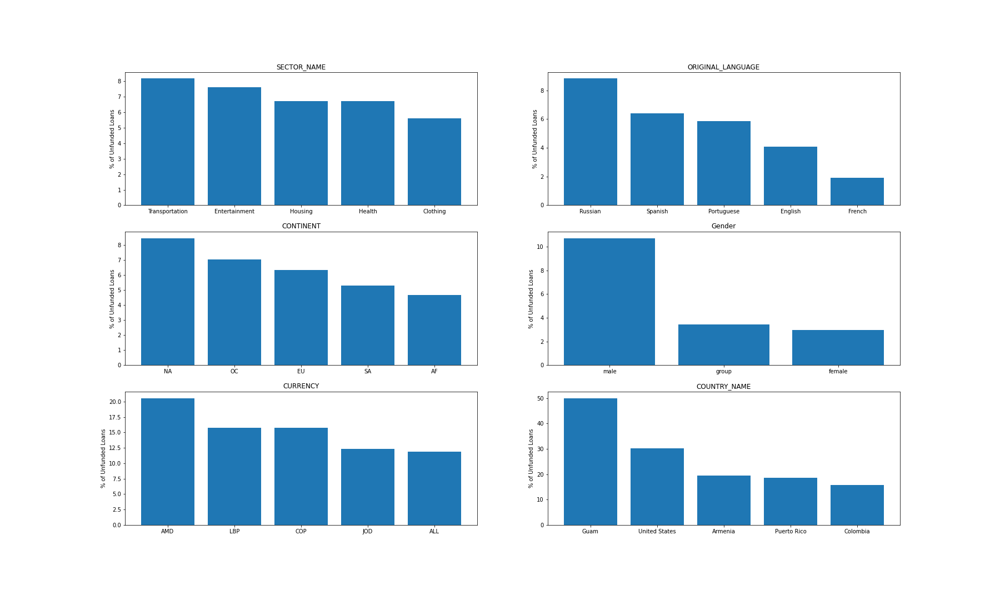

# Kiva Microfinance Loan Funding

*Microfinance has become a common tool to provide funding to those without access to formal banking or credit, primarily in developing countries. Loan recipients often borrow in groups, and use the funds for a variety of reasons, from education, to business inventory, to home construction costs. One microfinance institution, Kiva, has become popular by allowing people from around the world to act as the lenders for these small, short term loans. Loan seekers on Kiva create funding pages with descriptions of their life, family, location, and use case for the funds. This project will look at a large sample of Kiva loan requests, and try to predict whether a request will be funded, based on the features of the loan request and the loan seeker.*

## 1. Data

The dataset is a snapshot of all Kiva loan requests, downloaded on 3/15/2021.

> * [Kiva's Website](https://www.kiva.org/build/data-snapshots)

## 2. Data Wrangling 

[Data Wrangling Notebook](https://github.com/KevinmKrieg/Kiva-Microfinance/blob/6ca681986b3c9301d83c15ac3a47fa373ae4d729/data_wrangling.ipynb)

* **1:** The data downloaded from the snapshot was generally pretty clean already. There were aroundn 36,000 rows with 1 or more missing values. Due to the size of data present in the snapshot, these rows were simply dropped. 

* **2:** The pycountry library was used to map countries to their respective continent, for use as features later on  [pycountry library](https://pypi.org/project/pycountry/)

## 3. EDA

[EDA Notebook](https://github.com/KevinmKrieg/Kiva-Microfinance/blob/1d2b2b34ceadcf891af66a5adb389cf4108cbb32/exploratory_data_analysis.ipynb)

* 

## 4. Feature Engineering

[Features Notebook](feature_engineering.ipynb)

I chose to work with the Python [surprise library scikit](http://surpriselib.com/) for training my recommendation system. I tested all four different filtered datasets on the 11 different algorithms provided, and every time the Single Value Decomposition++ (SVD++) algorithm performed the best. It should be noted that this algorithm, although the most accurate is also the most computationally expensive, and that should be taken into account if this were to go into production.

## 5. Modeling

[Final Predictions Notebook](modeling.ipynb)

## 8. Future Improvements

* The biggest challenge for this project was the imbalanced class sizes, future imporvement in data collection could include obtaining more "unfunded" loans, instead of relying on artifical over/under sampling techniques. 
